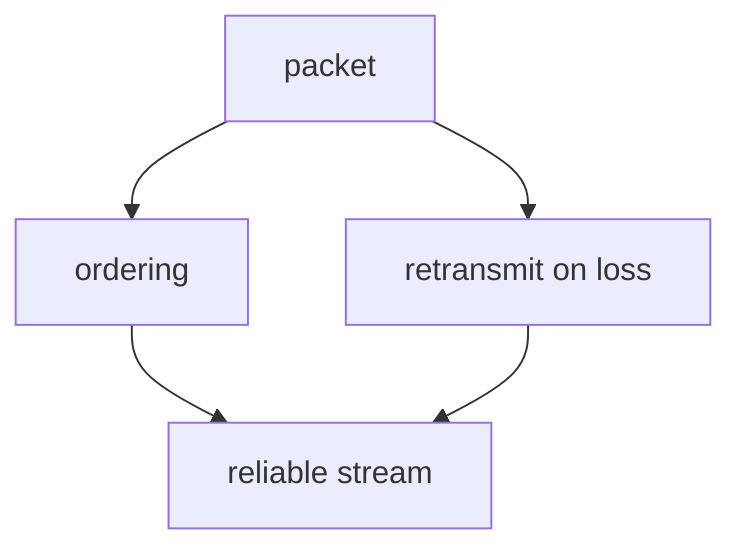

# Visualize

A picture earns its place only when it shows something words can't — shape, structure, direction, relationship, geometry. This skill produces ONE such picture and drops it into the lesson so it renders inline in the session log.

The log renders two things natively, both authored as plain text inside the markdown you pass to `mcp__learn__log`:

- **Mermaid** — a ```` ```mermaid ```` fenced block. Structural/relational visuals: dependency graphs, flowcharts, sequence/state/ER/class diagrams, trees, timelines. This is the default and fits the dependency-graph pedagogy directly.
- **Inline SVG** — a raw `<svg>…</svg>` element dropped straight into the markdown. For spatial/geometric visuals Mermaid can't lay out: exact coordinates, geometry figures, number lines, vectors, plots, custom shapes.

Rule of thumb: *nodes-and-edges / relationships* → mermaid. *Positions-and-shapes / geometry* → SVG.

## When to visualize (and when not to)

This teaching system builds a **dependency graph in the learner's head** — unconditional truths at the root, derived facts hanging off them. A visual is powerful exactly when it makes that structure (or a geometry) visible. Reach for one when:

- The idea is a **structure or relationship**: dependencies, a system with parts and arrows, a flow/pipeline, a sequence of exchanges, a state machine, a tree/hierarchy, a comparison, a containment (what's inside vs outside).
- The idea is **spatial or geometric**: coordinate geometry, a number line, vectors, a function's shape, a physical arrangement.

Do NOT visualize when prose or a single equation already carries it. A decorative diagram that just restates the sentence next to it adds noise and a chance to be wrong. When in doubt, don't — a missing visual is cheaper than a false one.

## One idea, fewest elements

The most common failure is **cramming** — every extra label makes the picture harder to read AND more likely to lay out badly. Before drawing, prune to the fewest elements that carry the idea, and for each ask: *"if I delete this, is the idea still clear?"* If yes, delete it. If you're past ~5–7 elements, cut first.

- BAD: a diagram "about how TCP works."
- GOOD: `graph TD` — a node `packet` at the top; arrows down to `ordering` and `retransmit on loss`; both arrows down into `reliable stream`. No title. It shows that reliability is built FROM packets, not alongside them.

Introduce the visual in a sentence, then let it carry the idea — don't narrate every element back in prose.

## Authoring rules that keep it correct

You are writing the source by hand, so correctness is on you. These are the failure modes worth guarding against:

**Mermaid**
- Declare the direction explicitly (`graph TD`, `graph LR`, `sequenceDiagram`, …) on the first line.
- Keep node ids short and alphanumeric; put the human text in brackets: `pkt[packet]`.
- Any label containing `(`, `)`, `:`, `,`, `-` or math must be quoted: `n["f(x) = x²"]`. Unquoted punctuation is the single most common parse failure.
- No LaTeX inside mermaid labels — it won't render. Use plain text or Unicode (`≤`, `π`, `x²`).
- Prefer one shape of diagram per block. Don't mix a flowchart and a sequence diagram.

**SVG**
- Always set `viewBox` and omit fixed `width`/`height` so it scales to the log's width.
- Use `currentColor` or the log's palette (`#46d68a` accent, `#c8d6cd` text, `#5a685f` muted) so it reads on the dark background — never hardcode black strokes or black text.
- Compute coordinates deliberately; a geometry figure that is subtly out of proportion teaches the wrong thing. Label axes and key points.
- Keep it flat: no gradients, no filters, no embedded fonts.

**Check it landed.** A mermaid block that fails to parse shows a visible `mermaid error` in the log instead of a diagram. If the learner reports one — or you can see the source is dubious — fix the source and log a corrected version rather than leaving a broken block.

## Embedding

Just include the block in the markdown you pass to `mcp__learn__log` (and mirror it in chat if useful). Nothing else to do:

````markdown
Reliability isn't a separate channel — it is *built out of* packets:


````

The session log saves this verbatim to `sessions/*.md`, so the lesson stays readable — and re-renderable — long after the session ends.
